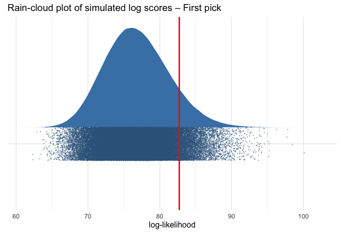
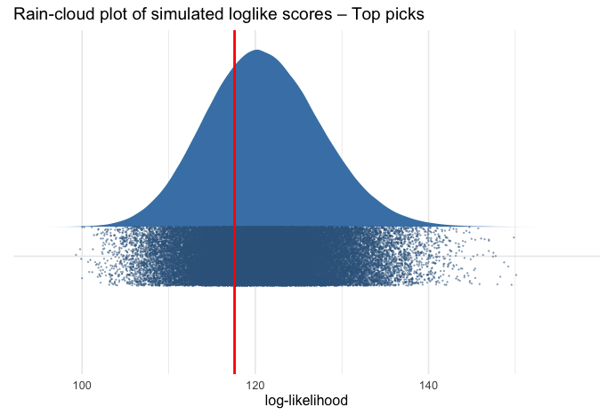
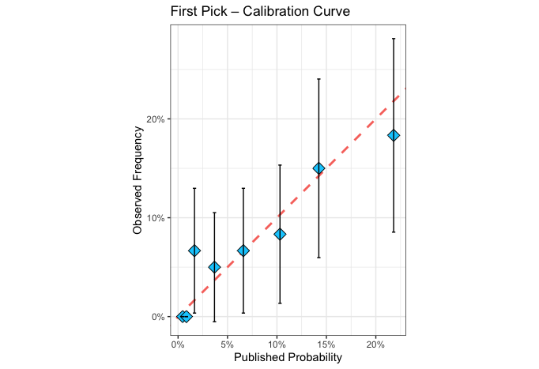
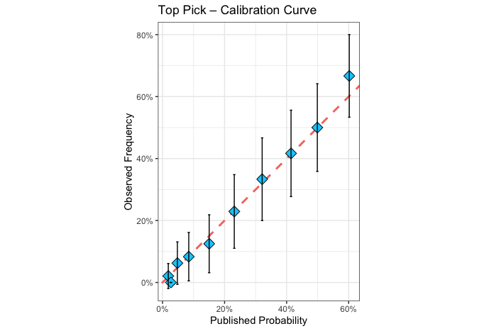

# Assessing NBA Lottery Fairness (1990-2025): A Statistical Analysis

To evaluate the "fairness" of NBA lottery drawings (1990-2025), we employ two distinct statistical approaches: comparing actual results against one million Monte Carlo simulations based on published odds, and directly examining the calibration of published probabilities relative to actual outcomes.

## Monte Carlo Log Score / Brier Test

Since we have complete probability lists for all lotteries under examination, repeated simulations provide a good estimate of the possible outcome distribution under the assumption of a fair lottery.

To compare the degree of deviation from expected odds, we can use two proper scoring rules - logarithmic score or Brier score, each answering a slightly different question.

The logarithmic scoring rule involves collecting all winners and calculating the logarithm (times -1) of each winner's probability:

$$LogScore = - \sum_{t = 1}^{36}{\log}{ p}_{w_{t}}$$

Thus, wins from low probabilities receive relatively large values, and minimal probabilities inflate the score disproportionately. This is a measure heavily influenced by major lottery surprises (like Dallas winning with 1.8%).

The Brier score treats both winning and non-winning teams symmetrically by subtracting each probability from a success factor (0/1) and squaring:

$$Brier = \frac{1}{N}\sum_{i = 1}^{N}{({y}_{i} - {p}_{i})}^{2}$$

Here, a team winning with 35% probability affects the measure the same as a team with 65% probability not winning. Again, particularly low probabilities receive significant weight due to squaring, but the slope of increase is more moderate than the logarithmic measure. Brier doesn't "explode" from every extreme outlier and thus remains more sensitive to subtle biases and deviations across all probabilities.

The choice between scoring rules reflects different conspiracy theories:

- **Brier score**: Tests if published odds systematically differ from true probabilities (i.e., the entire lottery is rigged)
- **Log score**: Tests for selective interventions in high-profile picks (i.e., occasional manipulation of surprising outcomes)

Since conspiracy theories typically focus on specific shocking upsets rather than systematic bias, we emphasize the log score analysis.

## Results

### First Pick Analysis

**Observed Deviation Score:** D_obs = 82.71569

**Monte Carlo Simulation Results:**
- Upper-tail p-value = 0.099297 (9.93%) (one-sided test for excess surprises)
- Mean of simulations: 76.82
- Standard deviation: 4.467
- IQR: 6.028
- 5th percentile: 69.897
- 95th percentile: 84.554

Our score of 82.716 is significantly higher than the simulation average of 76.82, with only 9.9% of simulations being more surprising than our reality. The result isn't significant—there's no strong evidence that lottery results are improbable under fair lottery assumptions. You could say it's suspicious, but consider this is a small sample of only 36 "successes," and we didn't conduct this test at a random time point but following Dallas's extreme surprise.

### Contributing Years to Deviation Score

| Year | Contribution | Team |
|------|-------------|------|
| 1993 | 4.186 | Orlando Magic |
| 2008 | 4.075 | Chicago Bulls |
| 2014 | 4.075 | Cleveland Cavaliers |
| 2025 | 4.017 | Dallas Mavericks |
| 2011 | 3.576 | Los Angeles Clippers → Cleveland Cavaliers |
| 2024 | 3.507 | Atlanta Hawks |
| 2000 | 3.124 | Minnesota Timberwolves |
| 2007 | 2.937 | Portland Trail Blazers |
| 2019 | 2.813 | New Orleans Pelicans |
| 2005 | 2.765 | Milwaukee Bucks |
| 2006 | 2.430 | Toronto Raptors |
| 2002 | 2.419 | Houston Rockets |
| 1995 | 2.364 | Golden State Warriors |
| 2010 | 2.273 | Washington Wizards |
| 1991 | 2.243 | Charlotte Hornets |
| 2017 | 2.129 | Brooklyn Nets → Boston Celtics → Philadelphia 76ers |

Dallas isn't the biggest surprise in lottery history but contributed significantly to the measure's extremity. Had we removed the last two years from the test, we'd be much closer to the distribution center. Indeed, excluding 2024 and 2025 yields a p-value of 0.23—far from statistical significance. This is the problem with a small sample with a non-random cut-off point.

Regarding narrative questions, none of the league's glamour teams—Lakers, Knicks, Celtics—appear among the surprises, despite all participating in numerous lotteries. Two picks (Mavericks and Pelicans) retroactively benefited teams that helped the Lakers, but no surprise actually benefited the club. The most central common factor in the top ten is LeBron James: Cleveland won the lottery a year after he left (3) and the summer he returned (5), New Orleans and Dallas won after trading a star to his team. I personally can't see how to build a coherent narrative around this surprise list.

### Any Lottery Pick Analysis

When examining all lottery winners (top 3 or 4 picks), results fell in the conservative half of the simulation distribution—fewer surprises than anticipated.

**Observed Deviation Score:** D_obs_top = 117.602

**Monte Carlo Simulation Results:**
- Upper-tail p-value = 0.687 (68.7%)
- Mean of simulations: 121.00
- Standard deviation: 6.630
- 5th percentile: 110.472
- 95th percentile: 132.249

### Brier Scores

Brier scores showed the same trends, only slightly less extreme:

**First Pick:**
- Observed Brier = 0.0659
- Simulation mean = 0.0641
- Percentile = 0.144 (14.4%)

**Any Top Pick:**
- Observed Brier = 0.1370
- Simulation mean = 0.1418
- Percentile = 0.768 (76.8%)

## Calibration Curve Analysis

Calibration curves allow us to assess the correspondence between winning probabilities and relative frequency of winners. We divide all teams into bins by their winning odds—if 5% of teams in the "5%" bin win, 30% in the "30%" bin, and so on, this represents perfect calibration. Graphically, we examine bin distribution around a 45-degree diagonal (intercept 0, slope 1)—meaning each percentage increase raises winning probability by exactly one percentage.

*For bin division, I used ntile which divides by number of observations per bin. This is significant with few successes to distribute among bins, and unique odds distribution that creates overcrowding at low percentages. For first pick testing, I divided into only eight bins.*

### First Pick Calibration

The calibration curve shows the entire win distribution without getting lost in individual lottery noise, indicating no evidence of bias or significant deviation from published probabilities.

Continuing previous tests, teams with very small odds (~2%) won slightly more than expected while teams with highest odds (>20%) won slightly less. However, considering the small number of winners and the surprises in the last two lotteries, the fit between odds and wins appears very good.

**Bin-level R²:** 0.898

Excellent fit of nearly 0.9.

### Linear Model - First Pick

| Parameter | Coefficient | SE | 95% CI | t(478) | p |
|-----------|-------------|----|---------|---------|----|
| (Intercept) | 0.01 | 0.01 | [-0.01, 0.04] | 0.99 | 0.324 |
| Prob1 | 0.83 | 0.21 | [0.41, 1.24] | 3.90 | < .001 |

**Hypothesis testing relative to slope = 1:**
- b1=0: Estimate = 0.0134, p = 0.324
- b2=1: Estimate = -0.1728, p = 0.416

We use linear regression to test whether the relationship between published odds and actual wins follows the expected 1:1 ratio. A slope of 1 would indicate perfect calibration, while our observed slope of 0.83 suggests a slight tendency toward upsets (underdogs winning more than expected). However, the hypothesis test shows this deviation from 1 is not statistically significant (p = 0.416).

### Any Lottery Pick Calibration

For "any lottery pick" testing, we have enough successes for ten bins:

This calibration graph is nearly perfect, with bins hugging the diagonal line even more than expected (except for minimal deviation favoring teams with very high odds).

**Bin-level R²:** 0.992

What more can we say...

### Linear Model - Any Top Pick

| Parameter | Coefficient | SE | 95% CI | t(478) | p |
|-----------|-------------|----|---------|---------|----|
| (Intercept) | -0.02 | 0.02 | [-0.05, 0.02] | -0.93 | 0.351 |
| ProbTopPick | 1.09 | 0.09 | [0.92, 1.26] | 12.54 | < .001 |

**Hypothesis testing relative to slope = 1:**
- b1=0: Estimate = -0.0164, p = 0.351
- b2=1: Estimate = 0.0857, p = 0.322

Here the slope of 1.09 is remarkably close to the ideal value of 1, and the hypothesis test confirms no significant deviation from perfect calibration (p = 0.322). This reinforces our finding that lottery picks overall match their published probabilities extremely well.

## Summary

Our comprehensive analysis yields a consistent picture: while first picks showed slightly more surprises than expected—driven primarily by recent events—and lottery picks overall showed slightly fewer, these deviations fall well within the range of random variation. No statistical evidence supports claims of systematic bias or manipulation in the lottery system.

## Files in this Repository

- `log_surprise.R` - Monte Carlo simulation analysis for log scores
- `sim_breyer.R` - Brier score analysis and simulations
- `calibration_plot_linear_model.R` - Calibration curve analysis and linear modeling
- `lottery_sim_results.csv` - Data file with lottery results and probabilities
- `images/` - Directory containing all generated plots and visualizations

## Technical Requirements

This analysis was conducted using R with the following packages:
- `dplyr` - Data manipulation
- `ggplot2` - Data visualization
- `ggdist` - Distribution visualizations
- `readr` - Data import
- `car` - Linear hypothesis testing
- `marginaleffects` - Model interpretation

## Methodology

The analysis employs two complementary approaches:

1. **Monte Carlo Simulation**: Comparing observed lottery outcomes against one million simulated fair lotteries
2. **Calibration Analysis**: Direct examination of how well published probabilities predict actual outcomes

Both approaches consistently indicate that the NBA lottery system operates fairly, with observed deviations well within expected random variation.
